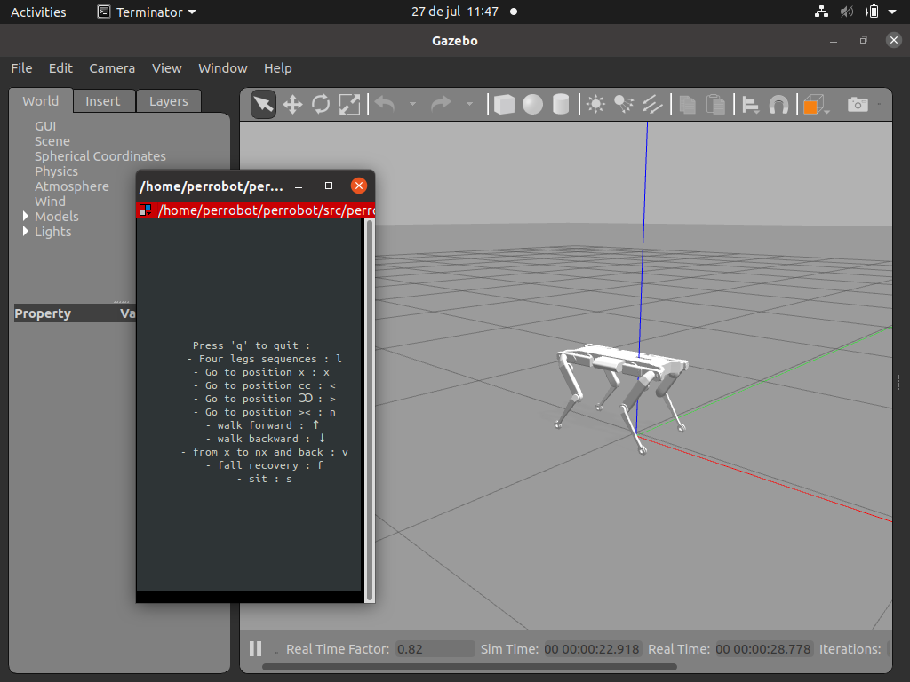

# The Perrobot Simulation - Python Code

This repository contains all the files and code needed to simulate the quadruped robot Perrobot, based on the Quadruped Robots from [Open Dynamic Robot Initiative](https://github.com/open-dynamic-robot-initiative/). This simulation was built in the context of an internship at ... using [Gazebo](https://gazebosim.org/home) and [ROS](https://www.ros.org/). The software runs on [ROS Noetic](http://wiki.ros.org/noetic) and [Ubuntu 20.04](http://www.releases.ubuntu.com/20.04/).

This README provides step-by-step instructions to set up and run the simulation for both the Perrobot 8DOF and 12DOF.

## Prerequisites

Before you begin, ensure you have the following installed:

- Ubuntu 20.04
- ROS Noetic

## Setup

Follow these steps to set up:

1. **Create a workspace and clone the repository in it**

```sh
cd ~
mkdir perrobot_test_ws && cd perrobot_test_ws
git clone https://github.com/Andy-Mod/perrobot.git

```

2. **Initialize the workspace **

```sh

cd src && catkin_init_workspace
cd .. && catkin_make
echo "source ~/perrobot_test_ws/devel/setup.bash" >> ~/.bashrc
source ~/.bashrc

```

3. **Install Python dependencies **

```sh
cd ~/perrobot_test_ws/
pip install -r requirements.txt

```
## Run

Two robot are simulated here : 

### The Perrobot 8dof 

```sh
roslaunch perrobot run_gazebo.launch

```

### The Perrobot 12dof 
```sh

roslaunch perrobot run_gazebo_12dof.launch 

```

## Interface 
After all the nodes have started, in both cases, here is the interface you get : 



Using your keybord, you can make the robot perform defferent set of actions.

